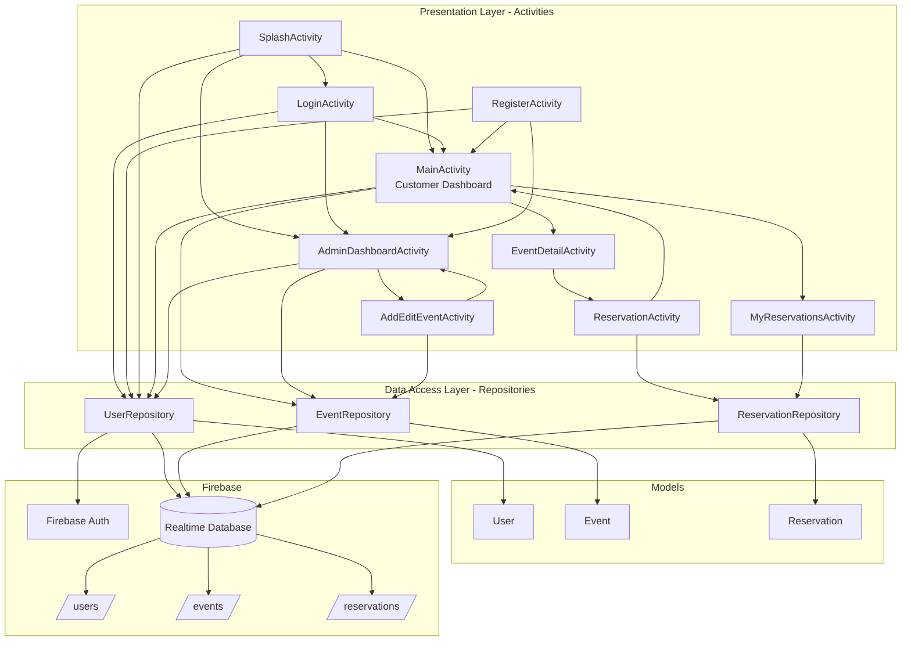

# Project Architecture

This project follows a lightweight layered architecture:

- **Presentation layer**: Android `Activity` classes (UI + navigation + user interactions)
- **Data access layer**: Repository classes wrapping Firebase access
- **Domain/data models**: Plain Java model classes (`User`, `Event`, `Reservation`)
- **Backend services**: Firebase Authentication and Realtime Database

## High-Level Diagram

## Package Structure

- `app/src/main/java/com/example/soen345_ticket/activities` -> UI and navigation
- `app/src/main/java/com/example/soen345_ticket/repositories` -> Firebase data operations
- `app/src/main/java/com/example/soen345_ticket/models` -> shared data objects
- `app/src/main/res/layout` -> XML UI layouts

## Key Notes

- Role-based routing is handled after authentication (`admin` vs `customer`).
- Reservation creation/cancellation updates seat counts using Firebase transactions.
- Lists are rendered from Firebase queries using FirebaseUI Recycler adapters.
