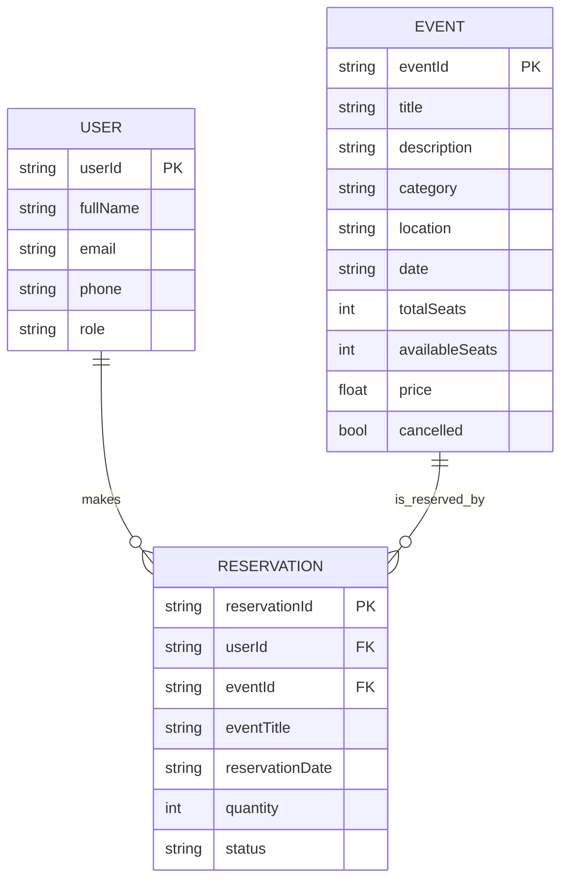

# Database Design

This app uses **Firebase Realtime Database** with three top-level collections (nodes):

- `users`
- `events`
- `reservations`

## Realtime Database Structure

```text
root
├── users
│   └── {userId}
│       ├── userId: string
│       ├── fullName: string
│       ├── email: string
│       ├── phone: string
│       └── role: "admin" | "customer"
├── events
│   └── {eventId}
│       ├── eventId: string
│       ├── title: string
│       ├── description: string
│       ├── category: string
│       ├── location: string
│       ├── date: string
│       ├── totalSeats: number
│       ├── availableSeats: number
│       ├── price: number
│       └── cancelled: boolean
└── reservations
    └── {reservationId}
        ├── reservationId: string
        ├── userId: string
        ├── eventId: string
        ├── eventTitle: string
        ├── reservationDate: string
        ├── quantity: number
        └── status: "active" | "cancelled"
```

## ER-Style Diagram



## Relationship Rules

- `users/{userId}` is keyed by Firebase Auth UID.
- `events/{eventId}` is keyed by `push()` generated id.
- `reservations/{reservationId}` is keyed by `push()` generated id.
- `reservations.userId` references `users.userId`.
- `reservations.eventId` references `events.eventId`.

## Consistency and Transactions

- On reservation creation:
  - A transaction runs on `events/{eventId}/availableSeats`.
  - Reservation write happens only if seats are available and transaction commits.
- On reservation cancellation:
  - A transaction increments `events/{eventId}/availableSeats`.
  - Reservation status is updated to `cancelled`.

## Query Patterns Used by App

- Customer event list: `events` filtered by `cancelled == false`.
- Admin event list: all `events`.
- Customer reservations: `reservations` filtered by `userId == currentUserId`.
- Event search in customer view: `events` by title prefix (manual query in `MainActivity`).

## Suggested Firebase Indexes

In Realtime Database rules, add indexes for query performance:

```json
{
  "rules": {
    "events": {
      ".indexOn": ["cancelled", "title"]
    },
    "reservations": {
      ".indexOn": ["userId"]
    }
  }
}
```

## Notes

- `reservation.eventTitle` is denormalized for UI display convenience.
- `date` and `reservationDate` are currently strings; migrating to ISO-8601 consistently is recommended for sorting/filtering reliability.
- Model comments mention Firestore, but implementation is Realtime Database.
