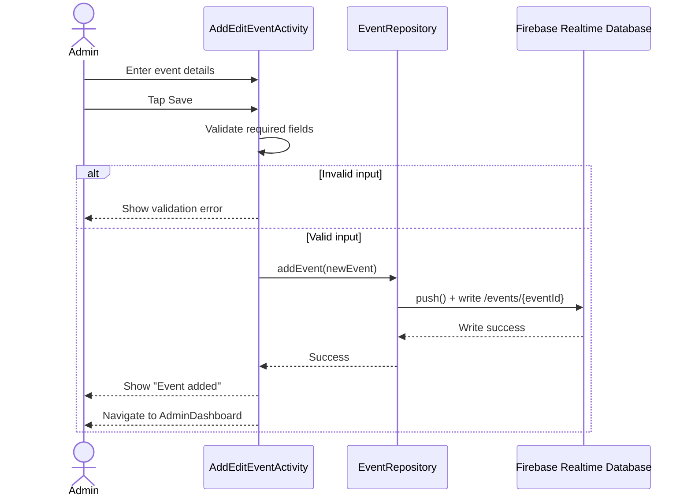

# AC1 Sequence Diagram - Add New Event

```mermaid
sequenceDiagram
    actor Admin
    participant AddEditEventActivity
    participant EventRepository
    participant RealtimeDB as Firebase Realtime Database

    Admin->>AddEditEventActivity: Enter event details
    Admin->>AddEditEventActivity: Tap Save
    AddEditEventActivity->>AddEditEventActivity: Validate required fields

    alt Invalid input
        AddEditEventActivity-->>Admin: Show validation error
    else Valid input
        AddEditEventActivity->>EventRepository: addEvent(newEvent)
        EventRepository->>RealtimeDB: push() + write /events/{eventId}
        RealtimeDB-->>EventRepository: Write success
        EventRepository-->>AddEditEventActivity: Success
        AddEditEventActivity-->>Admin: Show "Event added"
        AddEditEventActivity-->>Admin: Navigate to AdminDashboard
    end
```
