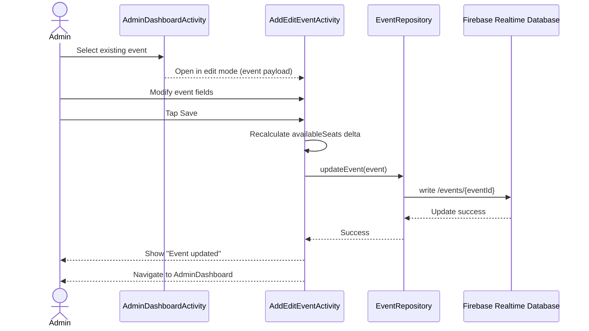

# AC2 Sequence Diagram - Edit Existing Event

```mermaid
sequenceDiagram
    actor Admin
    participant AdminDashboardActivity
    participant AddEditEventActivity
    participant EventRepository
    participant RealtimeDB as Firebase Realtime Database

    Admin->>AdminDashboardActivity: Select existing event
    AdminDashboardActivity-->>AddEditEventActivity: Open in edit mode (event payload)

    Admin->>AddEditEventActivity: Modify event fields
    Admin->>AddEditEventActivity: Tap Save
    AddEditEventActivity->>AddEditEventActivity: Recalculate availableSeats delta
    AddEditEventActivity->>EventRepository: updateEvent(event)
    EventRepository->>RealtimeDB: write /events/{eventId}
    RealtimeDB-->>EventRepository: Update success
    EventRepository-->>AddEditEventActivity: Success

    AddEditEventActivity-->>Admin: Show "Event updated"
    AddEditEventActivity-->>Admin: Navigate to AdminDashboard
```
