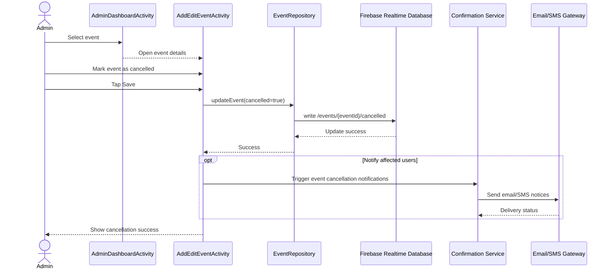

# AC3 Sequence Diagram - Cancel Event

```mermaid
sequenceDiagram
    actor Admin
    participant AdminDashboardActivity
    participant AddEditEventActivity
    participant EventRepository
    participant RealtimeDB as Firebase Realtime Database
    participant NotificationService as Confirmation Service
    participant EmailSMS as Email/SMS Gateway

    Admin->>AdminDashboardActivity: Select event
    AdminDashboardActivity-->>AddEditEventActivity: Open event details
    Admin->>AddEditEventActivity: Mark event as cancelled
    Admin->>AddEditEventActivity: Tap Save

    AddEditEventActivity->>EventRepository: updateEvent(cancelled=true)
    EventRepository->>RealtimeDB: write /events/{eventId}/cancelled
    RealtimeDB-->>EventRepository: Update success
    EventRepository-->>AddEditEventActivity: Success

    opt Notify affected users
        AddEditEventActivity->>NotificationService: Trigger event cancellation notifications
        NotificationService->>EmailSMS: Send email/SMS notices
        EmailSMS-->>NotificationService: Delivery status
    end

    AddEditEventActivity-->>Admin: Show cancellation success
```
