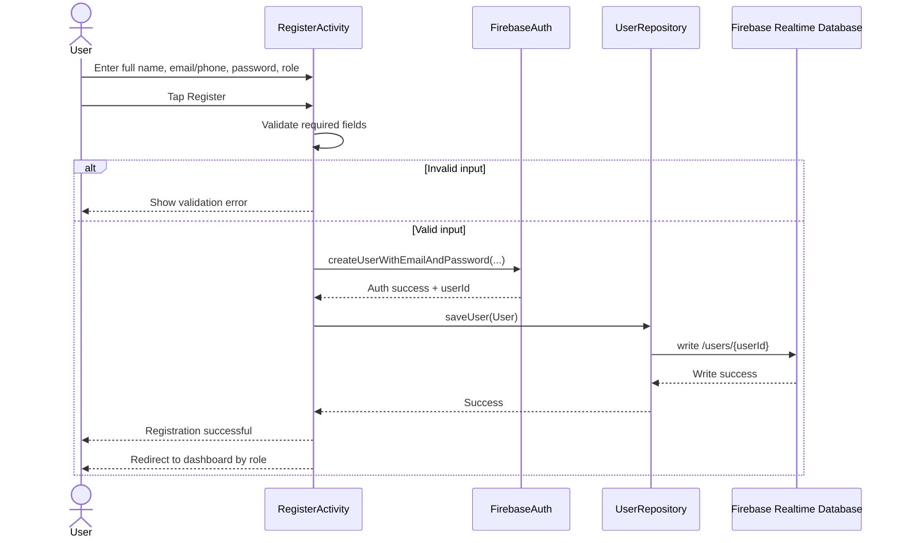

# UC1 Sequence Diagram - Register Account (Email or Phone)

```mermaid
sequenceDiagram
    actor User
    participant RegisterActivity
    participant FirebaseAuth
    participant UserRepository
    participant RealtimeDB as Firebase Realtime Database

    User->>RegisterActivity: Enter full name, email/phone, password, role
    User->>RegisterActivity: Tap Register
    RegisterActivity->>RegisterActivity: Validate required fields

    alt Invalid input
        RegisterActivity-->>User: Show validation error
    else Valid input
        RegisterActivity->>FirebaseAuth: createUserWithEmailAndPassword(...)
        FirebaseAuth-->>RegisterActivity: Auth success + userId
        RegisterActivity->>UserRepository: saveUser(User)
        UserRepository->>RealtimeDB: write /users/{userId}
        RealtimeDB-->>UserRepository: Write success
        UserRepository-->>RegisterActivity: Success
        RegisterActivity-->>User: Registration successful
        RegisterActivity-->>User: Redirect to dashboard by role
    end
```
