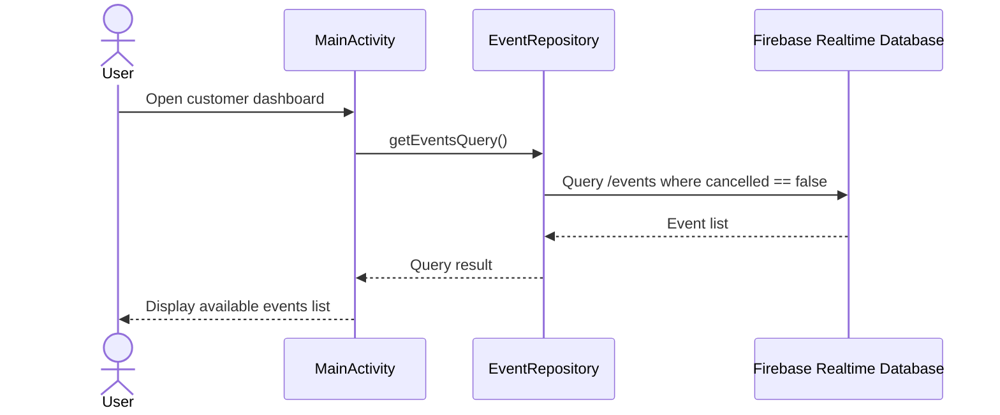

# UC2 Sequence Diagram - View Available Events

```mermaid
sequenceDiagram
    actor User
    participant MainActivity
    participant EventRepository
    participant RealtimeDB as Firebase Realtime Database

    User->>MainActivity: Open customer dashboard
    MainActivity->>EventRepository: getEventsQuery()
    EventRepository->>RealtimeDB: Query /events where cancelled == false
    RealtimeDB-->>EventRepository: Event list
    EventRepository-->>MainActivity: Query result
    MainActivity-->>User: Display available events list
```
