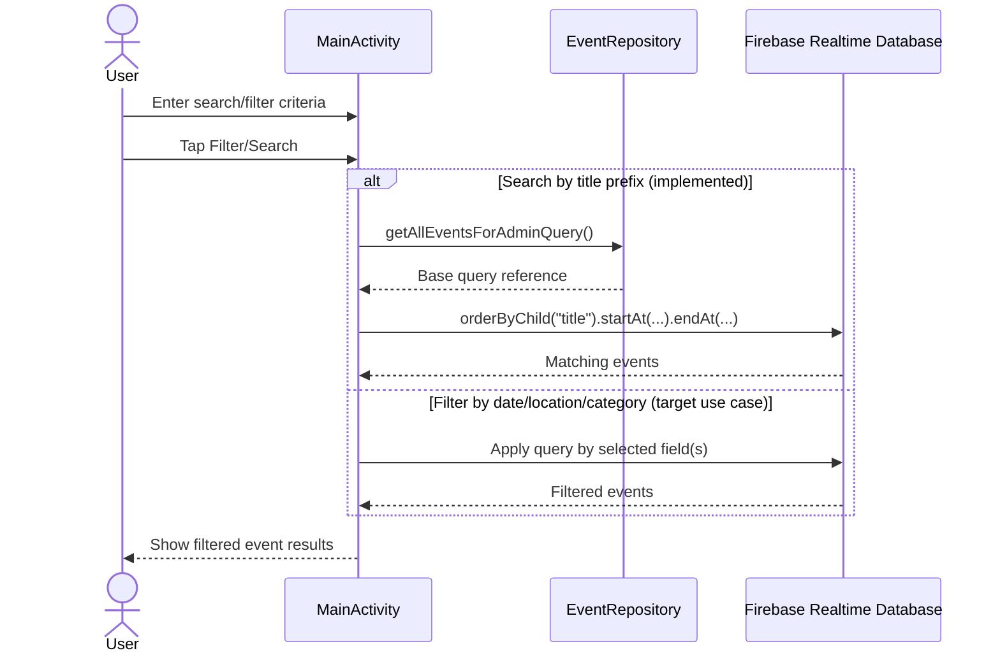

# UC3-UC4 Sequence Diagram - Search and Filter Events

```mermaid
sequenceDiagram
    actor User
    participant MainActivity
    participant EventRepository
    participant RealtimeDB as Firebase Realtime Database

    User->>MainActivity: Enter search/filter criteria
    User->>MainActivity: Tap Filter/Search

    alt Search by title prefix (implemented)
        MainActivity->>EventRepository: getAllEventsForAdminQuery()
        EventRepository-->>MainActivity: Base query reference
        MainActivity->>RealtimeDB: orderByChild("title").startAt(...).endAt(...)
        RealtimeDB-->>MainActivity: Matching events
    else Filter by date/location/category (target use case)
        MainActivity->>RealtimeDB: Apply query by selected field(s)
        RealtimeDB-->>MainActivity: Filtered events
    end

    MainActivity-->>User: Show filtered event results
```
