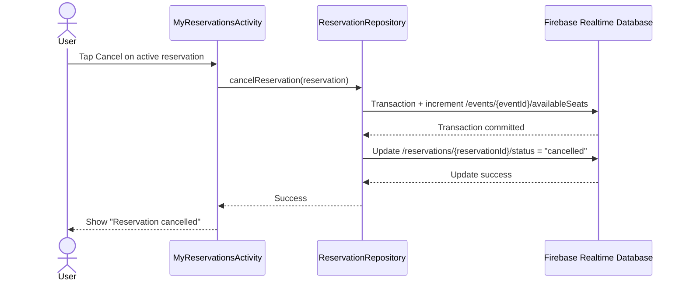

# UC5 Sequence Diagram - Cancel Reservation

```mermaid
sequenceDiagram
    actor User
    participant MyReservationsActivity
    participant ReservationRepository
    participant RealtimeDB as Firebase Realtime Database

    User->>MyReservationsActivity: Tap Cancel on active reservation
    MyReservationsActivity->>ReservationRepository: cancelReservation(reservation)

    ReservationRepository->>RealtimeDB: Transaction + increment /events/{eventId}/availableSeats
    RealtimeDB-->>ReservationRepository: Transaction committed

    ReservationRepository->>RealtimeDB: Update /reservations/{reservationId}/status = "cancelled"
    RealtimeDB-->>ReservationRepository: Update success
    ReservationRepository-->>MyReservationsActivity: Success

    MyReservationsActivity-->>User: Show "Reservation cancelled"
```
