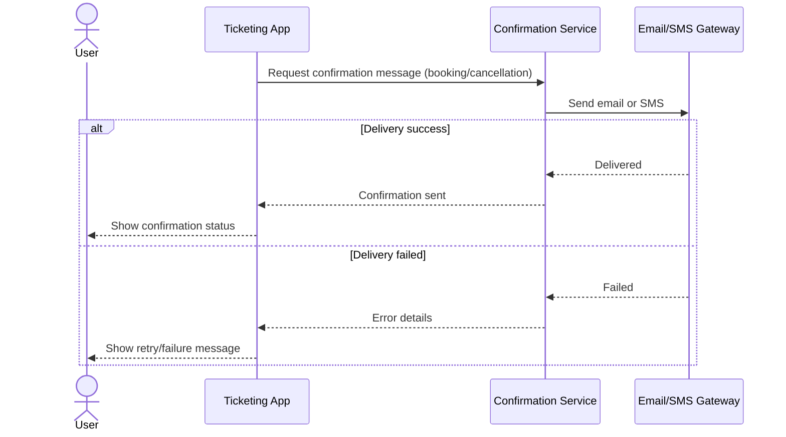

# UC6 Sequence Diagram - Receive Confirmation (Email/SMS)

```mermaid
sequenceDiagram
    actor User
    participant App as Ticketing App
    participant NotificationService as Confirmation Service
    participant EmailSMS as Email/SMS Gateway

    App->>NotificationService: Request confirmation message (booking/cancellation)
    NotificationService->>EmailSMS: Send email or SMS

    alt Delivery success
        EmailSMS-->>NotificationService: Delivered
        NotificationService-->>App: Confirmation sent
        App-->>User: Show confirmation status
    else Delivery failed
        EmailSMS-->>NotificationService: Failed
        NotificationService-->>App: Error details
        App-->>User: Show retry/failure message
    end
```
