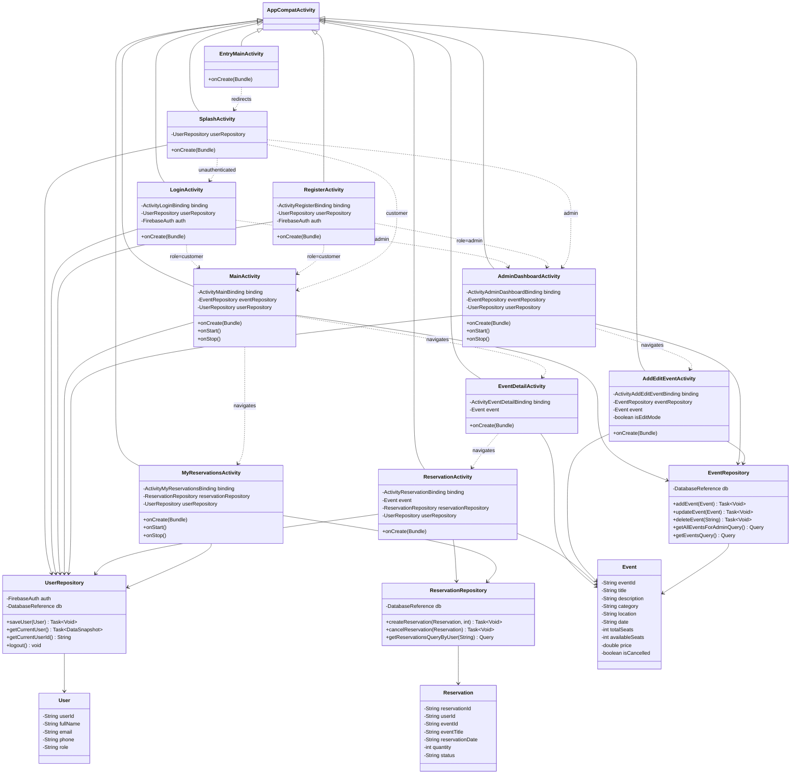

# UML Class Diagram

## Notes

- `EntryMainActivity` in this diagram represents `com.example.soen345_ticket.MainActivity` (placeholder launcher redirect).
- `MainActivity` in this diagram represents `com.example.soen345_ticket.activities.MainActivity` (customer dashboard).
- External Firebase and Android framework classes are intentionally abstracted to keep the diagram readable.
