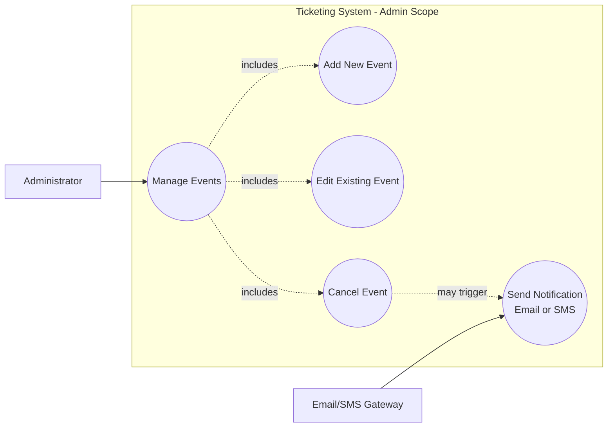

# Administrator Use Case Diagram

```mermaid
flowchart LR
    Admin[Administrator]
    EmailSMS[Email/SMS Gateway]

    subgraph System[Ticketing System - Admin Scope]
        UC_AddEvent((Add New Event))
        UC_EditEvent((Edit Existing Event))
        UC_CancelEvent((Cancel Event))

        UC_EventMgmt((Manage Events))
        UC_Confirm((Send Notification\nEmail or SMS))
    end

    Admin --> UC_EventMgmt
    UC_EventMgmt -. includes .-> UC_AddEvent
    UC_EventMgmt -. includes .-> UC_EditEvent
    UC_EventMgmt -. includes .-> UC_CancelEvent

    UC_CancelEvent -. may trigger .-> UC_Confirm

    EmailSMS --> UC_Confirm
```

## Use Cases (Admin)

- `AC1`: Add a new event
- `AC2`: Edit an existing event
- `AC3`: Cancel an event
