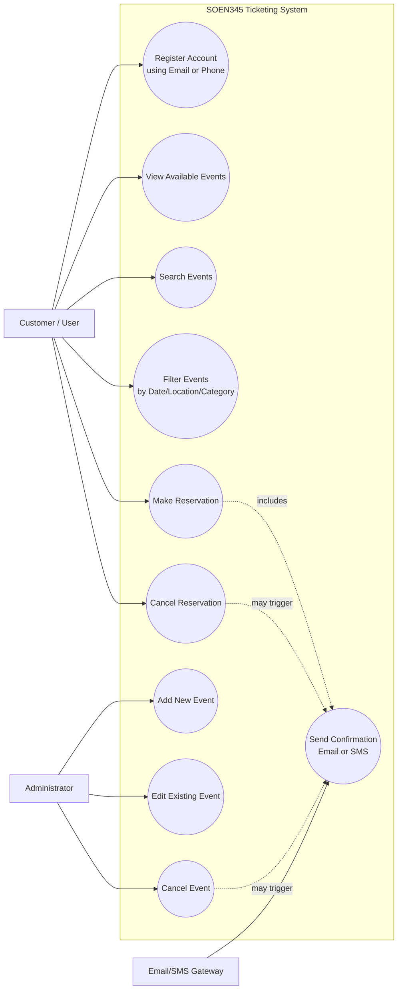

# Use Case Diagram Overview

## Covered Functional Requirements

### Users

- Register using email or phone number
- View a list of available events
- Search and filter events by date, location, or category
- Cancel reservations
- Receive confirmations via email or SMS

### Administrators

- Add new event
- Edit an existing event
- Cancel an event
