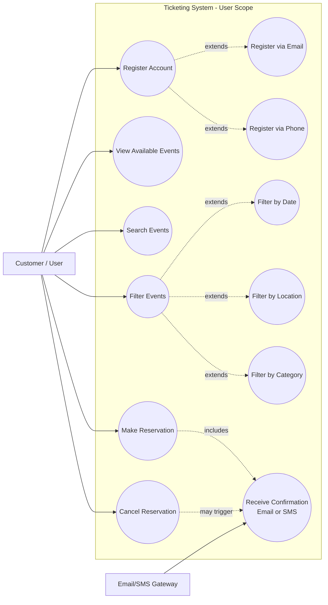

# User Use Case Diagram

## Use Cases (User)

- `UC1`: Register account (email or phone)
- `UC2`: View available events
- `UC3`: Search events
- `UC4`: Filter events by date/location/category
- `UC5`: Cancel reservation
- `UC6`: Receive confirmation via email/SMS
